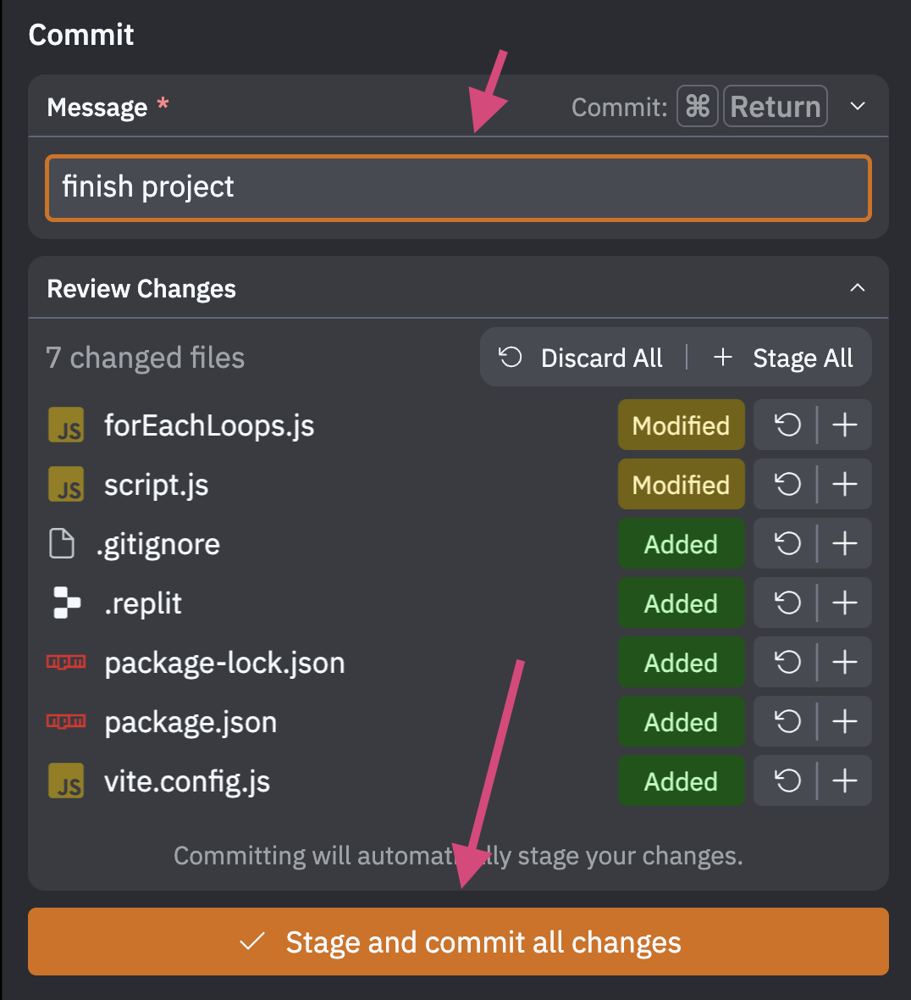

# How to commit your project to GitHub

To get started, go to Replit and open up your Unit 3 project. Then, on the bottom left in the Tools menu, click on "Git."

Then, on the right, enter a description of the changes, then click the big orange bottom button "Stage and commit all changes."

Then click "Sync with Remote." 

Click "Confirm for this session" in the dialog box that appears asking you to pass GitHub credentials.

It is possible that you will encounter errors relating to GitHub credentials. If so, send me an email, or leave a comment in Classroom.

---
## Once you're done with that, proceed to the [next step](publish).
