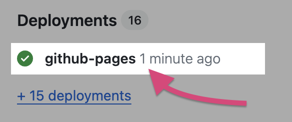
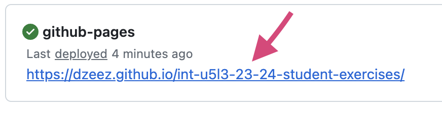

# Publish your project via GitHub Pages

In order to get a live, working URL for your project (web hosting), follow these instructions.

Go to GitHub.com, and find your Unit 3 project repository. Open it up, and click on the Settings tab (with gear icon) near the top, towards the right.

Click "Pages" on the left navigation.

Under "Branch," click the "None" dropdown and select the main branch, and click Save.

That's really all. Note that it will take a few minutes for everything to begin working.

### After waiting a few minutes...

Only thing left is to find the URL for the site. Go back to the main page of the repository.

Look on the right side to see if it shows github-pages under Deployments. If it doesn't, reload the page. Click it, it will open a new tab. 

There should be a blue, underlined URL in a box near the top. That's your publicly accessible web address. Right click the URL and copy it.

---
## One more step
The final step is to submit your project URL to [this form](https://forms.gle/UmPXoB9yhZt3TVRe6). We will collect all the projects and set up a page with links to all of them.
